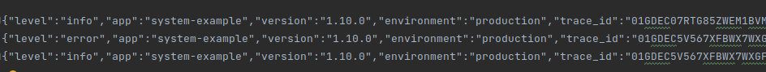

# Go Logger SDK


This is a package to facilitate the creation and standardization of structured logs in systems developed in Golang.


## Installation

```bash
  go get github.com/fretebras/go-logger
```


## Screenshots


```text
{"level":"info","app":"system-example","version":"1.10.0","environment":"production","trace_id":"01GDEC07RTG85ZWEM1BVMBSC6J","service":"sample-service","context":["632a11dc34ad9aff2b447acf","2022-09-20 18:13:58 -0300 -03","example],"time":1663708438311234,"message":"Success message"}
{"level":"error","app":"system-example","version":"1.10.0","environment":"production","trace_id":"01GDEC5V567XFBWX7WXGFVWWKM","service":"sample-service","context":["Message Error","632a2d2c34ad9aff2b447ad7","confirmed"],"trace":"/go/src/app/services/example/service.go:130","time":1663708621993235,"message":"message_error"}
{"level":"info","app":"system-example","version":"1.10.0","environment":"production","trace_id":"01GDEC5V567XFBWX7WXGFVWWKM","service":"sample-service":["632a2d2c34ad9aff2b447ad7","2022-09-20 18:17:01 -0300 -03","example"],"time":1663708621993326,"message":"Info Message"}
```


## Getting Started\

WIP